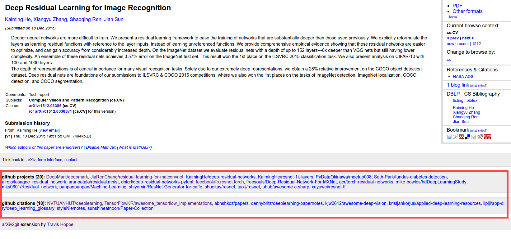

# arXiv2git
Links the [arXiv](http://arxiv.org/) to github repos

Why?

+ It's hard to search for papers like ["t \bar{t} W production and decay at NLO"](http://arxiv.org/abs/1204.5678).
+ Some papers have a lot of links [Deep Residual Learning for Image Recognition](http://arxiv.org/abs/1512.03385) and it may be hard to find all of them.
+ It builds a database of links for other uses

What?

Citations (links to github) are automatically added (via a Chrome extension) directly to the arXiv site.

What are `Projects`, `Citations`?

Sorted by github `stars`...
  

## Starter roadmap

- [x] Write basic repo searcher
- [x] Build (this) git repo
- [x] Use github tokens
- [x] parse month by month
- [x] build starter repo list
- [x] Write downloader of READMEs
- [ ] Allow downloader to only update changed READMEs
- [x] Download first pass of READMEs
- [x] Write parser of READMEs
- [x] Build set of links

## Plugin roadmap

- [x] Write working chrome extension (empty project)
- [x] Get code links to pull from github
- [x] Fix missing projects?
- [x] Handle missing references
- [ ] Push project to chrome store

## Website roadmap

- [ ] Turn list into static webpage
- [ ] Get list on live AWS instance for auto-updates
- [ ] Write API to query
- [ ] Notification for arXiv
- [ ] Feed for discovery

## Attributions
  
+ Icon made by [Freepik](http://www.flaticon.com/authors/freepik) from [www.flaticon.com](www.flaticon.com) under a Creative Commons 3.0 license.
